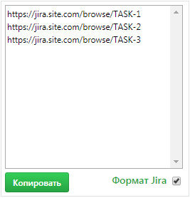

### GitHub x Jira linker
Расширение для Google Chrome, позволяющее получить список задач Jira, указанных в комментариях коммитов на Github.com.
#### **Что умеет:**
- Выводить список задач при сравнении веток
- Копировать в буфер список задач в формах:
    - Обычный текстовый список
    - Jira markdown

#### **Внешний вид:**

####**Настройка**
- В **manifest.json** заполнить рашрешение в ключе **permissions** (указать свой сайт, где хостится Jira)
    - Например: `https://jira.site.com/*` (вместе с *)
- В **lib/linkerlinker.js** заполнить переменные:
    - *jira_link_pattern* - Паттерн ссылок для парсинга коммитов
        - Например: `jira_link_pattern = "jira.site.com";`
    - *jira_api_url* - URL Jira API
        - Например: `jira_api_url = "https://jira.site.com/rest/api/latest/issue/";`

#### **Установка**
- На странице **chrome://extensions/** включить "Режим разработчика"
- Установить как "распакованное расширение", указав корневую директорию к расширению.

#### **Использование и особенности**
- После перехода на страницу сравнения коммитов обновить страницу.
- При переходе на другие страницы плашка с задачами останется (необходимо обновить страницу)
